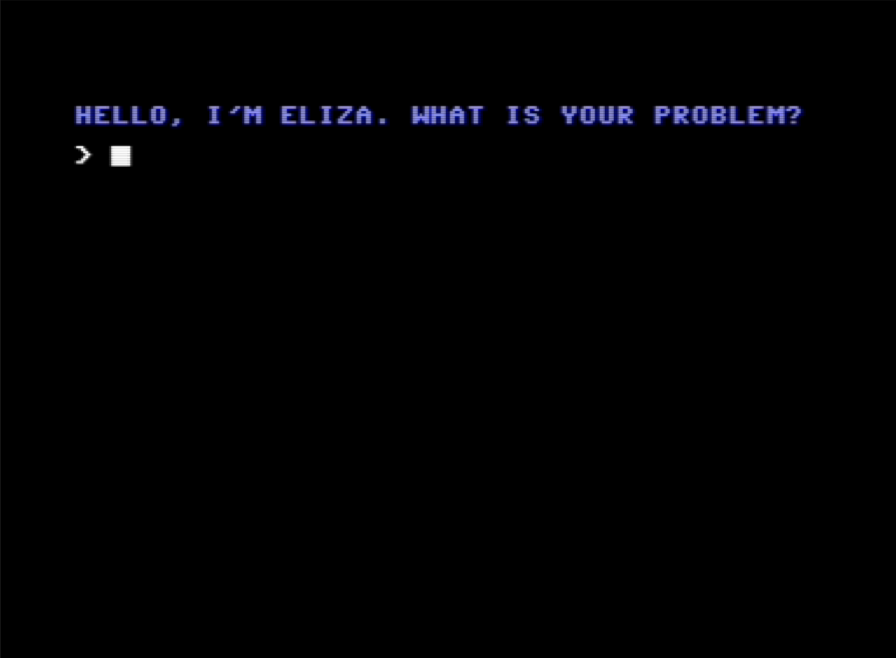

# ELIZA Resources

This repository contains some of my favorite resources on ELIZA, Joseph Weizenbaum's AI written in 1966.

Example Eliza transcript from the Commodore BASIC v2 Version of the script

## Content of the Repository

Resource               | Description
-----------------------|----------------------------------------------
[altair-8k/eliza.bas](altair-8k/eliza.bas)    | Steve Norths version of Jeff Shrager's code adopted for MITS Altair 8k Basic
[cbm-basic-v2/eliza.bas](cbm-basic-v2/eliza.bas) | A Commodore BASIC V2 implementation of Jeff Shrager's Eliza Implementation
[cpp/eliza.cpp](cpp/eliza.cpp)          | Close to the original C++ Port of Joseph Weizenbaum's original MAD-SLIP Code by Anthony Hay. Source: https://github.com/anthay/ELIZA
[Creative Computing](Creative%20Computing/Jul-Aug%201977%20-%20Eliza.pdf)     | Article from the July-August 1977 Issue of Creative Computing by Steve North
[gwbasic/eliza.bas](gwbasic/eliza.bas)      | GWBASIC / BASIC-A / QuickBasic / QBasic adoption of Jeff Shrager's code.
[mad-slip/eliza.pdf](mad-slip/eliza.pdf)     | Original Source Code by Joseph Weizenbaum in MAD-SLIP

